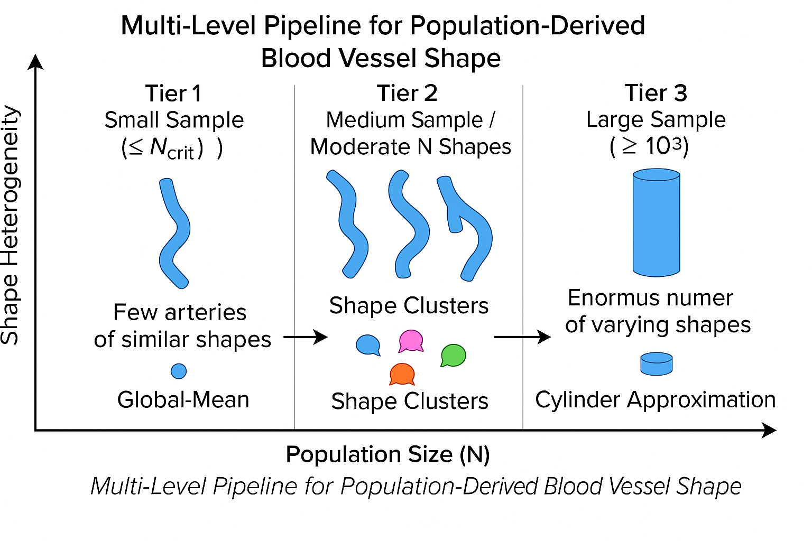
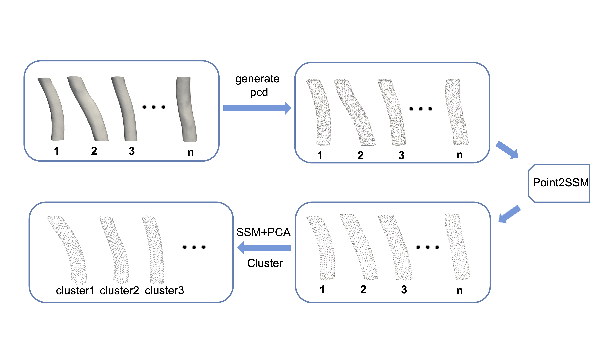
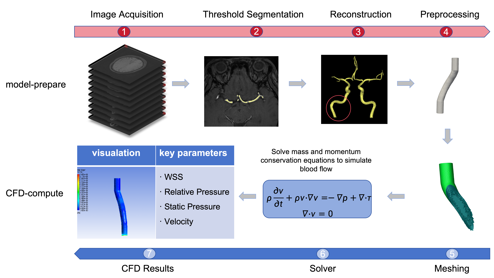
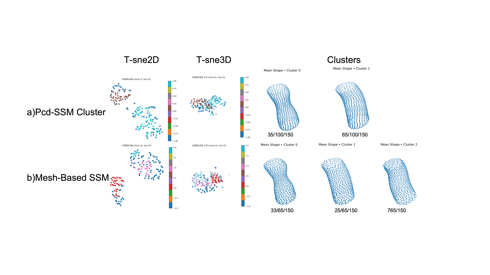
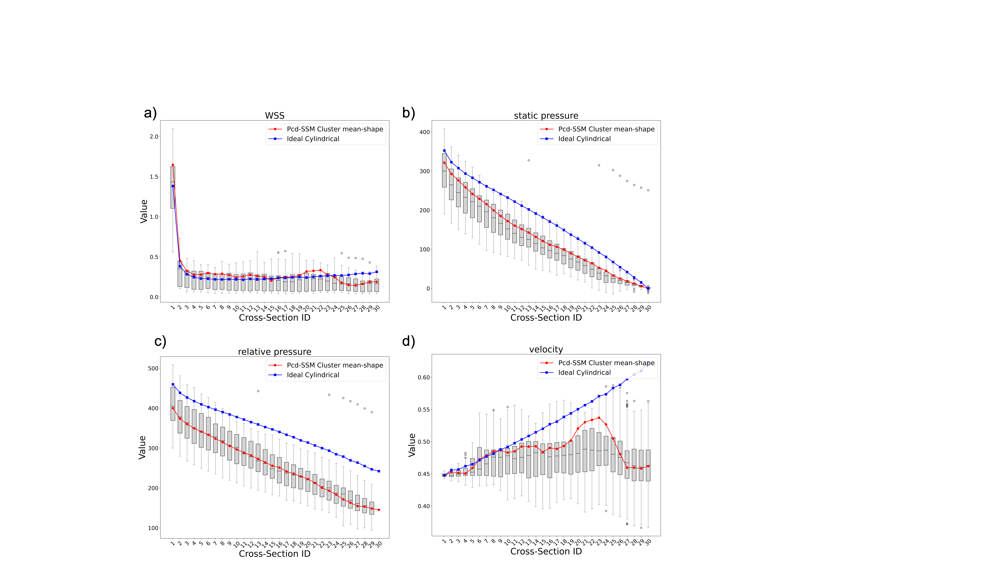
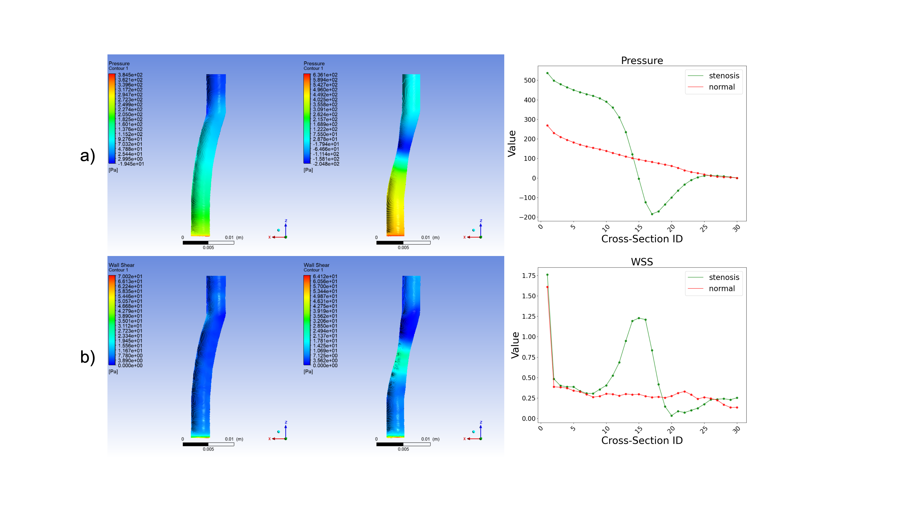

# Pcd-SSM + HDBSCAN Clustering for Population-level Hemodynamics

Official implementation of the **deep learning–based Point Cloud Statistical Shape Modeling (Pcd-SSM)** and **unsupervised clustering framework** described in:

> **Expanding point cloud statistical shape model applications: Generalized vascular modeling for population-level hemodynamic simulations**  
> *Yao Zeng, Zheng Sun, Mengfei Wang, Zhuo Li, Ao Liu, Meixiu Pan, Haifeng Zhao, Yuehua Li*  
> *Computer Methods and Programs in Biomedicine, 2025*  
> [DOI:10.1016/j.cmpb.2025.108924](https://doi.org/10.1016/j.cmpb.2025.108924)

---

## 🚀 Overview

Population-scale hemodynamic studies face a trade-off between **computationally expensive patient-specific CFD** and **overly idealized cylindrical models**.  
This repository provides a **tier-and-cluster generalization framework** integrating:

- Deep learning **Point2SSM** for automatic point correspondence  
- **Point cloud statistical shape modeling (Pcd-SSM) + PCA** for compact shape representation  
- **HDBSCAN clustering** to extract geometric subtypes  
- **Cluster mean models** to replace case-by-case CFD in medium-scale (Tier-2) cohorts  
- **Statistical validation** (MSE, Bootstrap-FDR, Bland–Altman)

⚡ This reduces per-case CFD computation by ~**65×** while maintaining **77–95% accuracy** compared with individual simulations.

---

## 🧩 Methodology & Figures

### Tiered population paradigm — **Fig.1**

  

Our study defines three cohort levels:
- **Tier 1:** N ≤ Ncrit (global mean model feasible)  
- **Tier 2:** Ncrit < N < 10³ (high shape heterogeneity, computationally heavy)  
- **Tier 3:** N ≥ 10³ (large-scale, often simplified cylinders)

---

### Proposed workflow — **Fig.2**

  

The full pipeline integrates:
1. TOF-MRA data preprocessing & vessel reconstruction  
2. **Point2SSM** training for unsupervised point correspondence  
3. **Pcd-SSM + PCA** to compress shape space  
4. **HDBSCAN clustering** to identify geometric subtypes  
5. **Cluster mean model** generation  
6. CFD simulation & statistical validation

---

### CFD pipeline — **Fig.6**

  

We run **steady-state CFD** with:
- Carreau non-Newtonian blood model  
- Velocity inlet (0.45 m/s), zero-pressure outlet  
- ANSYS Fluent 2022 R2 (coupled solver, residual < 1e-5)

---

### Clustering results — **Fig.9**

  

- Pcd-SSM produced **two robust clusters** with 66.7% data participation.  
- Traditional mesh-based SSM had more noise (only 43.3% clustered).  
- Pcd-SSM clusters clearly separate normal vs stenotic ICA morphologies.

---

### Section-wise hemodynamic validation — **Fig.11**

  

- Red = Pcd-SSM cluster mean model  
- Blue = ideal cylindrical model  
- Boxplots = individual CFD results  
- Pcd-SSM nearly overlaps with individual median curves for WSS & pressure.

---

### Normal vs stenosed flow fields — **Fig.12**

  

- Stenotic cluster: higher velocity peaks (0.88 m/s), sharper pressure drop, and WSS elevation.  
- Normal cluster: smoother velocity and pressure distribution.

---

## ⚙️ Installation

We recommend creating a Conda environment or running the quick install script.

### Option 1 — Conda environment (recommended)

    conda env create -f environment.yml
    conda activate pcd-ssm

### Option 2 — Quick install script

Please run the following command to install the required dependencies:

    bash setup.sh

The provided `environment.yml` contains all dependencies including PyTorch, Open3D, HDBSCAN, PyVista, and VTK.

---

## 📁 Dataset

Due to **data privacy restrictions**, we only provide **5 anonymized samples** each for training, validation, and testing under the `data/` directory.  
These samples are derived from real hospital patient data but fully anonymized for demonstration and reproducibility.

If you want to train on your own dataset, prepare:
- **TOF-MRA** scans (DICOM/NIfTI)
- Segmented STL / point cloud files
- Follow the same folder structure as provided samples.

---

## 🏋️ Training

Use the following command to train the model:

    python train.py -c cfgs/point2ssm.yaml

- `-c` specifies the configuration YAML file (default: `cfgs/point2ssm.yaml`).

---

## 🧪 Testing

Use the following command to test the model:

    python test.py -c experiments/vessels_normal/point2ssm_dgcnn/point2ssm.yaml

---

## ⚙️ Configuration

- All model configurations are defined in **YAML files**.  
- You can modify:
  - Dataset paths
  - Model architecture
  - Training hyperparameters
  - Evaluation settings

Example:

    dataset: vessels_normal
    model: dgcnn
    epochs: 200
    batch_size: 16
    learning_rate: 0.001

---

## 📚 More Information

- For additional code structure and configuration examples, please refer to the [original Point2SSM repository](https://anonymous.4open.science/r/PCD-SSM-07BE).  
- This implementation extends Point2SSM to **Tier-2 hemodynamic studies** by integrating PCA-based shape compression, HDBSCAN clustering, and CFD validation.

---

## 📊 Key Results

- **Critical sample size (Ncrit):** 40 → global mean models lose accuracy beyond this.  
- **Cluster mean models:** ~65× computational efficiency improvement, **77–95% MSE reduction** vs ideal cylinders.  
- Retain local curvature-induced **WSS hotspots**, **pressure drops**, and **velocity peaks**.

---

## 🧪 Citation

If you use this code or method in your research, please cite:

    @article{zeng2025pcdssm,
      title={Expanding Point Cloud Statistical Shape Model Applications: Generalized Vascular Modeling for Population-Level Hemodynamic Simulations},
      author={Yao Zeng and Zheng Sun and Mengfei Wang and Zhuo Li and Ao Liu and Meixiu Pan and Haifeng Zhao and Yuehua Li},
      journal={Computer Methods and Programs in Biomedicine},
      volume={269},
      pages={108924},
      year={2025},
      doi={10.1016/j.cmpb.2025.108924}
    }

---

## 📜 License

This project is licensed under the **MIT License** – see the [LICENSE](LICENSE) file for details.

---

## 🙌 Acknowledgments

- National Key R&D Program (No. 2023YFF1204800 & 2023YFF1204804)  
- National Natural Science Foundation of China (No. 8225024 & 81871329)  
- Shanghai Jiao Tong University Medicine and Engineering Interdisciplinary Program (No. YG2024LC08)  
- Shanghai 2023 “Explorer Plan” (No. 23TS1400400)
